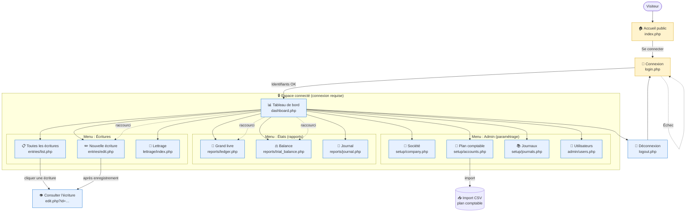

# Cartographie de l'application — Ketchup Compta

> Document de découverte à destination du PM. Objectif : comprendre les portes
> d'entrée, les menus, les pages et la navigation de l'application.
>
> Source : analyse du code (`www/header.php`, `www/index.php`, `www/login.php`,
> les modules sous `www/modules/`). Dernière mise à jour : 2026-06-30.

## Vue d'ensemble

L'appli a **2 portes d'entrée** : une page d'accueil publique et la page de
connexion. Une fois connecté, tout passe par un **menu unique en 4 rubriques**
(Tableau de bord, Écritures, États, Admin).

## Diagramme de navigation

## Comment lire ce diagramme

- **2 portes d'entrée** : `index.php` (vitrine publique, aucune donnée) et
  `login.php`. Tout le reste exige une connexion.
- **Le menu est le même partout** une fois connecté (défini dans
  `www/header.php`). Le diagramme relie le Tableau de bord aux pages pour la
  lisibilité, mais en réalité **chaque page affiche le menu complet** — on peut
  naviguer de n'importe où vers n'importe quoi.
- **3 grandes familles de fonctions** :
  - *Écritures* = le cœur métier (saisir/consulter les écritures comptables +
    lettrage).
  - *États* = les rapports en lecture seule (grand livre, balance, journal).
  - *Admin* = le paramétrage (société, plan comptable, journaux, utilisateurs).
- **Quelques liens « cachés »** non visibles dans le menu : cliquer sur une
  écriture dans la liste ouvre sa consultation (`edit.php?id=…`), et le plan
  comptable permet un **import CSV**.

## Inventaire des pages

| Page | Fichier | Rubrique | Rôle |
|------|---------|----------|------|
| Accueil public | `www/index.php` | — (public) | Vitrine, bouton « Se connecter » |
| Connexion | `www/login.php` | — (public) | Authentification |
| Déconnexion | `www/logout.php` | — | Ferme la session |
| Tableau de bord | `www/dashboard.php` | Accueil connecté | Synthèse + raccourcis |
| Nouvelle écriture | `www/modules/entries/edit.php` | Écritures | Saisie en partie double (aussi consultation via `?id=`) |
| Toutes les écritures | `www/modules/entries/list.php` | Écritures | Liste des écritures |
| Lettrage | `www/modules/lettrage/index.php` | Écritures | Rapprochement des écritures |
| Grand livre | `www/modules/reports/ledger.php` | États | Rapport (lecture seule) |
| Balance | `www/modules/reports/trial_balance.php` | États | Rapport (lecture seule) |
| Journal | `www/modules/reports/journal.php` | États | Rapport (lecture seule) |
| Société | `www/modules/setup/company.php` | Admin | Paramètres de l'entreprise |
| Plan comptable | `www/modules/setup/accounts.php` | Admin | Comptes + import CSV |
| Journaux | `www/modules/setup/journals.php` | Admin | Journaux (VE, AC, BK, OD) |
| Utilisateurs | `www/modules/admin/users.php` | Admin | Gestion des comptes utilisateurs |

## ⚠️ Point à signaler : les rôles ne sont pas appliqués

La doc du projet (`CLAUDE.md`) décrit **3 rôles** (admin / comptable / lecteur)
censés restreindre l'accès. Mais dans le code réel, **toutes les pages internes
exigent seulement « être connecté »** (`require_login()`), et **aucune** n'appelle
de contrôle de rôle (`require_role()`).

**Conséquence** : n'importe quel utilisateur connecté peut accéder à l'admin,
créer des utilisateurs, modifier le plan comptable, etc.

À clarifier avec le tech lead : comportement intentionnel (projet « legacy
trainer ») ou vrai trou de sécurité ?

## Pistes pour la suite

1. **Zoomer sur un module** (ex. le parcours de saisie d'une écriture, le plus
   complexe — `entries/edit.php`, ~850 lignes).
2. **Cartographier les données** (quelles tables, qui écrit quoi) — voir le
   `MODELE_DONNEES.md` en cours.
3. **Documenter les rôles/permissions** réels vs attendus.
