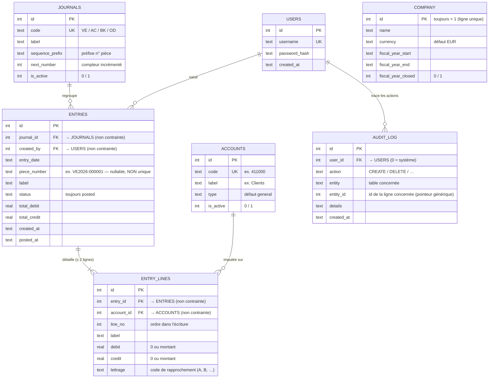

# Ketchup Compta — Modèle de données

> **Source de vérité : le schéma SQLite *live* + `sql/01_schema.sql`** — pas `CLAUDE.md`
> ni `SPECS.md`, qui décrivent un modèle ne correspondant pas à la base réelle (cf. §4).
> Vérifié le 30/06/2026 contre `www/data/compta.db` (conteneur `dojo-ai-pm-s5-web-1`).
>
> Ce document a deux niveaux de lecture : une **vue d'ensemble pour le PM** (§1), puis une
> **référence technique détaillée** (§2 à §4) pour les échanges avec la tech.

---

## 1. Vue d'ensemble (lecture PM)

Ketchup Compta repose sur **7 tables seulement**. L'ERD ci-dessous montre la structure
et les relations.

### Les 3 groupes de tables

**1. Le référentiel (ce qu'on paramètre une fois)**
- `COMPANY` — les infos de la société. **Une seule ligne** (id = 1), c'est de la config.
- `ACCOUNTS` — le plan comptable (la liste des comptes, ex. « 411000 – Clients »).
- `JOURNALS` — les journaux (Ventes, Achats, Banque, OD), chacun avec son **compteur**
  servant à numéroter les pièces.
- `USERS` — les comptes de connexion.

**2. Le cœur transactionnel (la compta du quotidien)**
- `ENTRIES` = l'**en-tête** d'une écriture (date, journal, n° de pièce, totaux).
- `ENTRY_LINES` = les **lignes** de cette écriture (le détail compte par compte, débit/crédit).
- Relation centrale : **une écriture contient au moins 2 lignes** — tout le principe de la
  partie double.

**3. La traçabilité**
- `AUDIT_LOG` — un journal des actions (qui a créé/supprimé quoi, et quand).

### Les 3 points à retenir

1. **Le lettrage n'est pas une table** : c'est une simple colonne `lettrage` sur les lignes.
   Les lignes d'un même compte partageant le même code (A, B, …) sont « rapprochées ».
2. **`AUDIT_LOG` pointe vers tout et rien** : `entity` + `entity_id` désignent « table X,
   ligne Y » de façon générique — ce n'est pas un vrai lien vérifié.
3. **⚠️ Les liens entre tables ne sont PAS verrouillés par la base.** `journal_id`,
   `account_id`, `entry_id`… sont de simples nombres, sans clé étrangère active. Les flèches
   de l'ERD décrivent l'**intention** du modèle ; l'intégrité repose entièrement sur le code
   PHP, pas sur la base.

---

## 2. Cardinalités — justifiées par les colonnes FK

| Relation | Cardinalité | Justification structurelle (schéma) |
|---|---|---|
| `journals` → `entries` | 1 — 0..N | `entries.journal_id` **NOT NULL** ⇒ toute écriture a exactement 1 journal ; un journal peut n'avoir aucune écriture. |
| `users` → `entries` | 1 — 0..N | `entries.created_by` **NOT NULL** ⇒ toute écriture a 1 auteur ; un user peut n'avoir rien saisi. |
| `entries` → `entry_lines` | 1 — 0..N | `entry_lines.entry_id` **NOT NULL** ⇒ toute ligne appartient à 1 écriture. *(le « au moins 2 lignes » est **métier**, pas structurel — voir §3)* |
| `accounts` → `entry_lines` | 1 — 0..N | `entry_lines.account_id` **NOT NULL** ⇒ toute ligne impute 1 compte. |
| `users` → `audit_log` | 1 — 0..N | `audit_log.user_id` **NOT NULL** ⇒ trace rattachée à 1 user… *mais* le trigger d'audit insère `user_id = 0` faute de user `system` ⇒ orphelin possible. |

> Le côté « exactement 1 » (`||`) reflète le `NOT NULL` de la colonne. Comme **aucune FK
> n'est active**, ce « 1 » n'est pas vérifié à l'écriture : intention de modèle, pas garantie
> d'intégrité référentielle.

---

## 3. Contraintes dures — **structurelles uniquement** (pas les règles métier)

Tout ce qui suit est imposé par la **base** (DDL + triggers). Les règles métier (équilibre
débit = crédit, ≥ 2 lignes, format du n° de pièce…) vivent dans le PHP et **ne sont pas** des
contraintes de base — elles sont volontairement exclues ici.

### 3.1 Clés primaires
- `users`, `accounts`, `journals`, `entries`, `entry_lines`, `audit_log` : `id INTEGER PRIMARY KEY AUTOINCREMENT`.
- `company` : `id INTEGER PRIMARY KEY DEFAULT 1` (pas d'autoincrément).

### 3.2 Unicité (`UNIQUE`) — le seul anti-doublon réellement appliqué
- `users.username` **UNIQUE**
- `accounts.code` **UNIQUE**
- `journals.code` **UNIQUE**

### 3.3 NOT NULL
- Toutes les colonnes le sont **sauf** : `entries.piece_number`, `entries.posted_at`,
  `entry_lines.lettrage`, `audit_log.entity_id`, `audit_log.details`.

### 3.4 Valeurs par défaut
`company.currency='EUR'` · `company.fiscal_year_closed=0` · `accounts.type='general'` ·
`accounts.is_active=1` · `journals.next_number=1` · `journals.is_active=1` ·
`entries.status='posted'` · `entries.total_debit=0` · `entries.total_credit=0` ·
`entry_lines.debit=0` · `entry_lines.credit=0`.

### 3.5 Triggers (présents dans la base LIVE — **absents de `01_schema.sql`**)
| Trigger | Effet structurel |
|---|---|
| `trg_round_entry_line_insert` / `_update` | `ABORT` si `debit` ou `credit` > **999999.99** (plafond montant). |
| `trg_protect_posted_entries` | `ABORT` sur `DELETE` d'une `entries` dont `status='posted'`. **NB : aucune protection sur l'`UPDATE`.** |
| `trg_entry_touch_insert` | Renseigne `created_at` après insert si NULL. |
| `trg_audit_account_delete` | Insère une ligne `audit_log` à la suppression d'un compte (`user_id` ← user `system`, sinon **0**). |

### 3.6 `CHECK` et `FOREIGN KEY`
- **Aucune contrainte `CHECK`.**
- **Aucune `FOREIGN KEY`** déclarée, et `PRAGMA foreign_keys = 0` (désactivé). Intégrité
  référentielle = 0 côté base.

### 3.7 Index
`idx_accounts_code`, `idx_accounts_type`, `idx_entries_journal`, `idx_entries_date`,
`idx_entries_piece`, `idx_entries_status`, `idx_entry_lines_entry`, `idx_entry_lines_account`,
`idx_entry_lines_lettrage (account_id, lettrage)`, `idx_audit_log_user`, `idx_audit_log_action`,
`idx_audit_log_entity (entity, entity_id)`. **Tous non-uniques.**

---

## 4. Là où la doc ment (à confirmer avec la tech)

| Affirmation `CLAUDE.md` / `SPECS.md` | Réalité de la base |
|---|---|
| « `users` — id, username, password_hash, **role** (admin/accountant/viewer) » | **Pas de colonne `role`.** D'où le `require_login()` partout, sans contrôle de rôle. |
| « Posted entries are immutable and **have a piece number** » | `piece_number` est **NULLABLE** et **non UNIQUE** (index simple) ⇒ doublons et n° vides possibles. Immuabilité : seul le `DELETE` est bloqué (trigger), **pas l'`UPDATE`**. |
| Relations / intégrité sous-entendues | **Zéro FK active.** Tout repose sur le nommage et le code PHP. |
| `sql/01_schema.sql` = le schéma | Le fichier **omet les 5 triggers** réellement présents en base. Même le schéma versionné diverge du live. |

### Garde-fou anti-doublon (structurel, pas métier)
**Garanti par la base :** unicité de `username`, `accounts.code`, `journals.code`.
**NON garanti — doublons structurellement possibles :** `entries.piece_number`,
`(entry_lines.entry_id, line_no)`, codes de `lettrage`, et même plusieurs lignes dans
`company` (rien n'interdit `id=2`). Ces unicités-là dépendent du code applicatif, pas du schéma.

---

## Voir aussi
- [CARTOGRAPHIE.md](CARTOGRAPHIE.md) — les pages et la navigation.
- [PARCOURS_ECRITURE.md](PARCOURS_ECRITURE.md) — le parcours détaillé de saisie d'une écriture.
