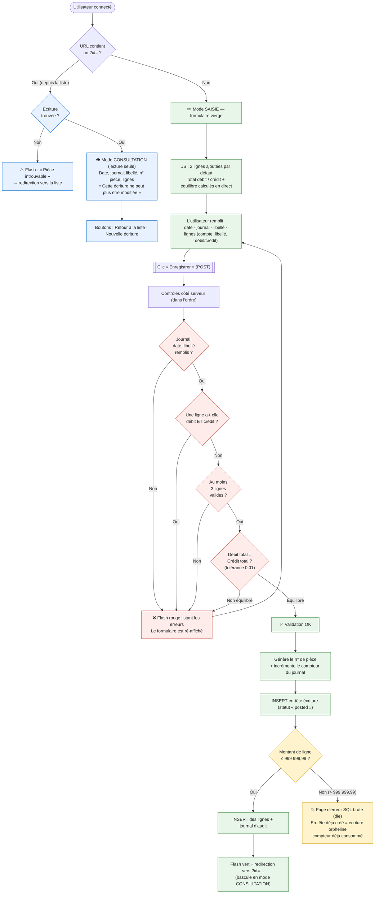

# Parcours détaillé — Saisie d'une écriture

> Zoom « micro » sur le parcours de création/consultation d'une écriture
> comptable (`www/modules/entries/edit.php`). Établi par lecture du code **et**
> navigation réelle dans l'application (tests des cas limites en conditions
> réelles). Dernière mise à jour : 2026-06-30.
>
> Voir aussi : [CARTOGRAPHIE.md](CARTOGRAPHIE.md) pour la vue d'ensemble.

## En une phrase

Une même page (`edit.php`) sert à **deux usages** : sans paramètre = formulaire
de **saisie** d'une nouvelle écriture ; avec `?id=…` = **consultation** d'une
écriture existante, en **lecture seule** (les écritures validées sont
immuables).

## Diagramme du parcours

## Règles métier vérifiées (ce qui est bien contrôlé)

Testées en envoyant réellement les formulaires à l'application :

| Cas testé | Résultat observé |
|-----------|------------------|
| Écriture équilibrée valide | ✅ Créée, redirection vers la consultation |
| Débit ≠ crédit (100 vs 50) | ❌ Bloqué : « La pièce n'est pas équilibrée » |
| Une seule ligne | ❌ Bloqué : « Une pièce doit avoir au moins 2 lignes » |
| Une ligne avec débit **et** crédit | ❌ Bloqué : « une ligne ne peut avoir à la fois un débit et un crédit » |
| Journal / libellé vides | ❌ Bloqué : champs obligatoires |
| Compte non choisi sur une ligne | La ligne est **ignorée** silencieusement |

## Restrictions et points d'attention découverts

### 1. Les écritures sont immuables (et protégées en base)
- Une écriture est **« posted » dès sa création** (pas de brouillon).
- Le mode consultation est en **lecture seule** ; il n'existe aucun écran de
  modification ni de suppression.
- La base de données refuse elle-même toute suppression d'écriture validée
  (trigger `trg_protect_posted_entries` → « Impossible de supprimer une écriture
  validée »). La protection est donc garantie même hors de l'application.

### 2. ⚠️ La date n'est pas réellement obligatoire côté serveur
- Une date vide ou invalide (ex. « demain ») **n'est pas rejetée** : le contrôle
  « date obligatoire » ne se déclenche jamais dans ce cas, à cause d'un détail
  technique (la date invalide est transformée en texte `« NULL »`, considéré
  comme « non vide »).
- Conséquence observée : une écriture a été créée avec une **date corrompue**
  (le texte littéral « NULL » au lieu d'une vraie date).
- *Garde-fou partiel* : le champ du formulaire est de type « date » et marqué
  requis, donc un utilisateur via le navigateur est gêné — mais la protection
  est purement cosmétique (contournable, et absente côté serveur).

### 3. ⚠️ Montant maximum caché : 999 999,99 par ligne
- La base rejette tout montant de ligne supérieur à **999 999,99**
  (trigger `trg_round_entry_line_insert`).
- Ce plafond **n'est pas contrôlé** par l'application avant l'enregistrement.
- Comme l'en-tête de l'écriture est inséré **avant** les lignes et **sans
  transaction**, dépasser ce plafond produit : une **page d'erreur SQL brute**,
  une **écriture orpheline** (en-tête sans lignes) et un **numéro de pièce
  consommé pour rien**.

### 4. ⚠️ La protection anti-CSRF est inopérante sur cette page
- La page appelle bien la vérification du jeton de sécurité, mais **n'utilise
  pas son résultat** : une écriture envoyée **sans aucun jeton** a été créée
  normalement lors du test.
- Impact : protection théorique uniquement (à clarifier avec le tech lead —
  probablement intentionnel pour ce « legacy trainer », mais à noter).

### 5. Numérotation des pièces
- Format : `{préfixe}{année}-{numéro sur 6 chiffres}`, ex. `OD2026-000004`.
- Le compteur du journal est incrémenté **sans transaction** : en cas d'échec
  ultérieur (cf. point 3), le numéro est perdu (trou dans la séquence).

## Pour rejouer / vérifier

Tests menés via l'app lancée localement (`docker-compose up -d`, login
admin/admin123), en envoyant les formulaires sur
`/modules/entries/edit.php`. Les cas testés sont listés dans le tableau
ci-dessus et dans les points d'attention.

> Note : les tests d'écriture créent de vraies écritures « posted »
> (non supprimables par design). Pour repartir d'un état propre, réinitialiser
> la base : `docker-compose down -v && docker-compose up -d`.
