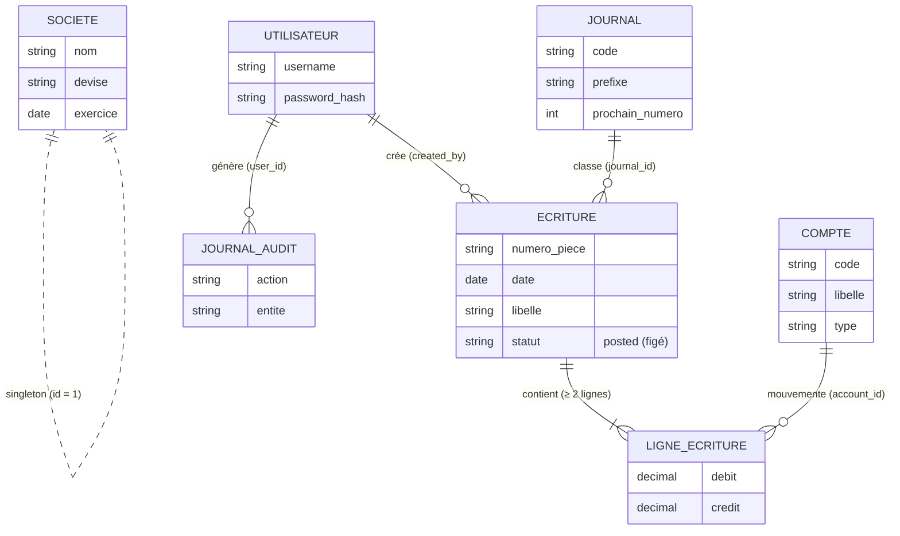
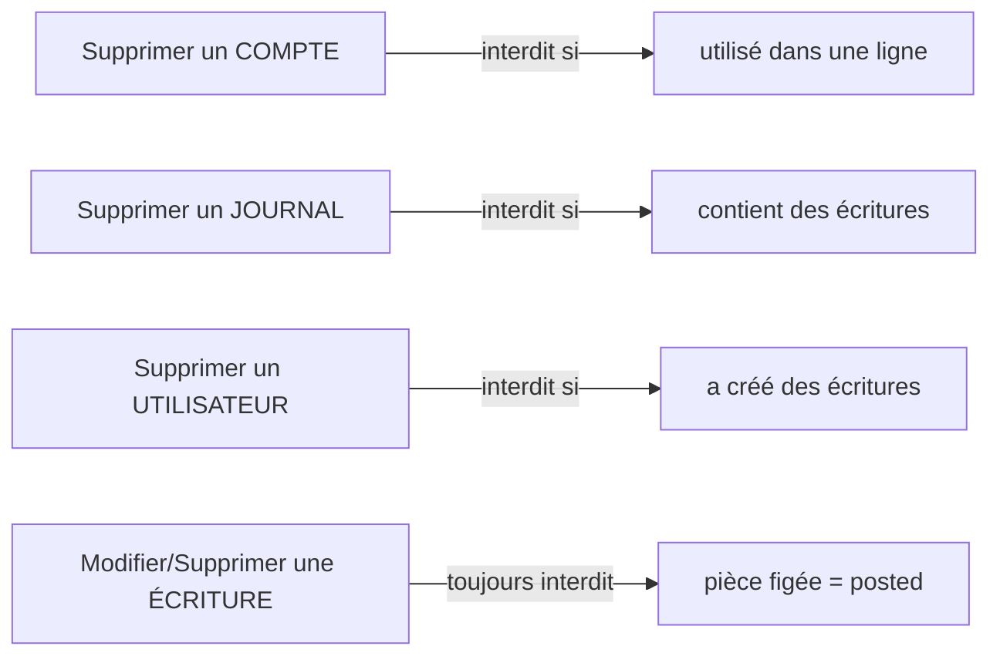

# 🍅 Ketchup Compta — Notions produit

> Document d'onboarding produit. Décrit le **périmètre réel du code** (et non l'intention documentée dans `CLAUDE.md`, qui mentionne des fonctionnalités non implémentées).
> Dernière mise à jour : 2026-06-24.

---

## 1. Contexte de l'application

**Ketchup Compta** est un logiciel de **tenue de comptabilité en partie double** (méthode française, Plan Comptable Général) destiné à une **structure unique** — une seule société, type TPE/PME.

Sa promesse tient en une phrase : permettre d'**enregistrer les opérations comptables** (factures, règlements, frais…) de façon équilibrée et traçable, puis d'en **restituer automatiquement les états comptables** (journal, grand livre, balance).

### Positionnement & limites

| Le produit **fait** | Le produit **ne fait pas** |
|---|---|
| Paramétrer le cadre comptable (société, comptes, journaux) | Gérer la TVA automatiquement |
| Saisir des écritures équilibrées | Rapprochement bancaire |
| Produire journal / grand livre / balance | Facturation, devis |
| Tracer les actions (audit) | Export comptable (FEC), PDF |
| | Clôture d'exercice |

> ⚠️ La page d'accueil et la doc évoquent parfois « TVA », « PDF », « rapprochement » : **ce sont des promesses non tenues par le code**. À traiter comme du backlog potentiel, pas comme de l'existant.

### Pile technique (résumé non-technique)

- Application **web**, accessible sur `http://localhost:8080`.
- Données stockées dans un **fichier de base unique** (SQLite) — pas de serveur de base de données externe.
- Déploiement par **Docker** (`docker-compose up -d`).
- Connexion par défaut : `admin` / `admin123`.

---

## 2. Utilisateurs & rôles

⚠️ **Point de vigilance majeur** : il existe un écart entre l'intention et la réalité.

| | Intention (doc `CLAUDE.md`) | Réalité du code |
|---|---|---|
| **Rôles** | `admin`, `accountant`, `viewer` | **Aucun rôle** — la notion n'existe pas en base |
| **Permissions** | Droits différenciés | **Tout utilisateur connecté peut tout faire** |

### Les profils réels

| Profil | Accès | Peut faire |
|---|---|---|
| **Visiteur** (non connecté) | Page d'accueil + connexion | Rien d'autre |
| **Utilisateur connecté** | **Toute l'application** | Saisir des écritures **ET** administrer comptes, journaux, utilisateurs, société |

→ Il n'y a donc, en pratique, **qu'un seul type d'utilisateur authentifié**, avec les pleins pouvoirs. On peut créer plusieurs comptes de connexion, mais ils sont **strictement équivalents**.

> 💡 **Backlog produit** : si la cible est de distinguer un *comptable* (saisit), un *consultant/viewer* (lit seulement) et un *admin* (paramètre), **c'est une fonctionnalité à construire**.

---

## 3. Fonctionnalités clés (ce que permet l'application)

### 🔧 Paramétrer le cadre comptable
- **Société** — devise et dates d'exercice (un seul enregistrement, mono-société).
- **Plan comptable** — créer / modifier / supprimer des comptes, avec **import CSV en masse**.
- **Journaux** — gérer les journaux (Ventes, Achats, Banque, OD…) et leurs compteurs de numérotation.
- **Utilisateurs** — créer / modifier / supprimer des comptes de connexion.

### 💶 Saisir des écritures *(le cœur du produit)*
- Saisie d'une **écriture en partie double** : un en-tête + plusieurs lignes débit/crédit.
- **Contrôles métier automatiques** : équilibre débit = crédit (tolérance 0,01 €), minimum 2 lignes, une ligne = débit *ou* crédit, champs obligatoires.
- **Numérotation légale automatique** des pièces (ex. `VE2026-000001`).
- **Immuabilité** : une écriture validée ne peut plus être ni modifiée ni supprimée.

### 📊 Consulter les états comptables *(lecture seule, recalculés)*
- **Journal** — écritures regroupées par journal.
- **Grand livre** — mouvements regroupés par compte, avec solde progressif.
- **Balance générale** — totaux et soldes par compte, avec contrôle d'équilibre.
- **Tableau de bord** — statistiques + dernières écritures.

### 🧾 Tracer & sécuriser
- **Journal d'audit** automatique (connexions, créations, suppressions).
- Protection **CSRF** sur les formulaires, sessions.

---

## 4. Les objets du produit & leurs dépendances

### Inventaire des objets

| Objet | Actions possibles | Règle de dépendance |
|---|---|---|
| **Société** | Modifier uniquement | Singleton (toujours 1 enregistrement) |
| **Utilisateur** | Créer / Modifier / Supprimer | Suppression **bloquée** s'il a créé des écritures ; pas d'auto-suppression |
| **Compte** (plan comptable) | Créer / Modifier / Supprimer / Importer | Suppression **bloquée** s'il est utilisé dans une ligne d'écriture |
| **Journal** | Créer / Modifier / Supprimer | Suppression **bloquée** s'il contient des écritures |
| **Écriture** (pièce) | Créer / Consulter | **Immuable** une fois créée (ni édition ni suppression) |
| **Ligne d'écriture** | Créée avec l'écriture | N'existe jamais seule — toujours rattachée à une écriture |
| **Journal d'audit** | Automatique | Lecture seule, jamais édité |

### Diagramme des dépendances

### Lecture du diagramme

- Une **écriture** est le point de convergence : elle dépend d'un **journal** (qui la classe et la numérote) et d'un **utilisateur** (son auteur).
- Une **écriture** contient au minimum **2 lignes** ; chaque **ligne** mouvemente un **compte** du plan comptable.
- Le **journal d'audit** référence l'**utilisateur** à l'origine de chaque action.
- La **société** est isolée : un paramétrage global unique.

### Les dépendances « bloquantes » (à connaître pour les specs)

Ces contraintes empêchent de casser l'intégrité comptable — toute évolution doit les respecter :

> **Principe directeur :** on paramètre librement *en amont*, mais on n'altère **jamais** une écriture une fois passée. C'est l'exigence comptable fondamentale du produit.

---

## 5. Risques identifiés

> Risques relevés à la lecture du code. Sévérité : 🔴 critique · 🟠 élevé · 🟡 modéré.
> Certains relèvent du « legacy assumé », mais **plusieurs sont des bugs concrets** (signalés ci-dessous).

### 5.1 Sécurité

| Risque | Sévérité | Impact |
|---|---|---|
| **Protection CSRF non appliquée** *(bug)* | 🔴 | Tous les formulaires appellent `csrf_verify()` mais **ignorent son résultat** : la requête n'est jamais bloquée. La fonction `require_csrf()` qui protégerait réellement n'est utilisée nulle part. Un site malveillant peut donc faire créer/supprimer des données à l'insu de l'utilisateur connecté. |
| **Mots de passe en MD5 + sel fixe** | 🔴 | Hachage trivialement cassable. En cas de fuite de la base, tous les mots de passe sont récupérables. |
| **Aucun contrôle d'accès par rôle** | 🟠 | Tout utilisateur connecté peut administrer comptes, journaux et **utilisateurs** (créer/supprimer des accès). Aucune séparation des privilèges. |
| **Injection SQL (surface importante)** | 🟠 | Le SQL est construit par concaténation de chaînes. L'échappement existe (`db_escape`) mais le motif est fragile : toute requête future mal échappée ouvre une faille. |
| **Identifiants par défaut affichés** | 🟡 | `admin / admin123` est codé en dur et **affiché sur la page de connexion**. |
| **Fuite d'information sur erreur** | 🟡 | En cas d'erreur SQL, la requête complète est affichée à l'écran (`die()`). |
| **Page de reset exposée** | 🟡 | `/test_reset.php` permet de réinitialiser la base ; à ne jamais laisser accessible. |

### 5.2 Intégrité comptable & données

| Risque | Sévérité | Impact |
|---|---|---|
| **Création d'écriture non atomique** *(bug)* | 🔴 | En-tête, lignes et compteur de numérotation sont écrits **sans transaction**. Si une ligne échoue en cours de route (ex. montant > 999 999,99 € bloqué par un trigger), un en-tête **déséquilibré ou orphelin** peut rester en base, faussant tous les états. |
| **N° de pièce basé sur l'année courante, pas sur la date d'écriture** *(bug)* | 🟠 | Une écriture datée 2025 mais saisie en 2026 reçoit un numéro `…2026-…`. Incohérence entre la numérotation légale et la date comptable. |
| **Numérotation sujette aux collisions** | 🟠 | Le compteur est lu puis incrémenté en deux opérations séparées (« no transaction »). Deux saisies simultanées peuvent produire le **même numéro de pièce**. |
| **Aucune notion de période fermée** | 🟠 | Le champ `fiscal_year_closed` existe mais **n'est jamais utilisé** : on peut saisir à n'importe quelle date, y compris hors exercice ou sur une période censée être close. |
| **Pas de correction d'écriture (contre-passation)** | 🟠 | Une écriture erronée est **figée à vie**, sans aucun mécanisme de correction (annulation / contre-passation). Le seul recours actuel serait une intervention directe en base. |
| **Montants négatifs non contrôlés** | 🟡 | Aucune validation que débit/crédit soient positifs : des montants négatifs pourraient simuler un équilibre et contourner le plafond. |

### 5.3 Affichage & comportements « magiques »

| Risque | Sévérité | Impact |
|---|---|---|
| **Filtre d'affichage global agressif** | 🟠 | Une transformation appliquée à **toute** sortie HTML (`_compta_transform_output`) masque les mots SQL et reformate les nombres. Effet de bord : un libellé légitime contenant « DELETE », « UPDATE »… s'affiche corrompu (`[DELETE]…`), et tout nombre à 2 décimales peut être reformaté à tort. Comportement difficile à diagnostiquer. |

### 5.4 Exploitation & maintenance

| Risque | Sévérité | Impact |
|---|---|---|
| **SQLite mono-fichier / mono-écrivain** | 🟠 | Verrouillage en écriture concurrente : monte mal en charge dès quelques utilisateurs simultanés. Pas de stratégie de sauvegarde documentée. |
| **Documentation divergente du code** | 🟡 | `CLAUDE.md` décrit des rôles, la TVA, l'export PDF, le rapprochement bancaire — **aucun n'existe**. Risque de mauvaise estimation du périmètre par les nouvelles parties prenantes. |

### Priorités suggérées (pour cadrage backlog)

1. **🔴 Rétablir la protection CSRF** — remplacer `csrf_verify()` par `require_csrf()` (correctif simple, fort impact).
2. **🔴 Encapsuler la création d'écriture dans une transaction** — garantir l'atomicité de la pièce.
3. **🟠 Aligner l'année du n° de pièce sur la date d'écriture.**
4. **🟠 Décider de la stratégie de rôles** (le sujet le plus structurant côté produit).
5. **🟠 Prévoir un mécanisme de contre-passation** pour corriger une écriture sans violer l'immuabilité.
