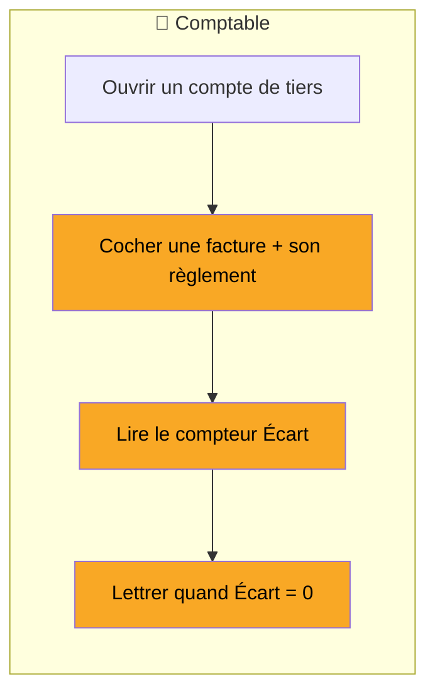

# Spec : Lettrage manuel (Ketchup Compta)

> Issue d'une session de cadrage produit (grill-me), Séance 3. Décrit le périmètre **v1** décidé.
> Dernière mise à jour : 2026-06-25.

## Pourquoi

Rapprocher les **factures de leurs règlements** sur les comptes de tiers, pour répondre à la question business : **« qui me doit encore de l'argent, et qu'est-ce que je dois encore régler ? »** Ce qui reste **non lettré** = les impayés (clients) et restes à payer (fournisseurs).



---

## Cas d'utilisation

### UC1 : Lettrer une facture avec son règlement

- **Contexte** : sur un compte de tiers (ex. 411000 - Clients), une facture et son règlement du **même montant** sont présents et **non lettrés**. Le comptable veut les marquer soldés.
- **Étapes** :
  1. Ouvrir le compte de tiers, onglet **Non lettré**.
  2. Cocher les deux lignes qui se compensent (la facture et son règlement).
  3. Un compteur affiche en direct **Total débit / Total crédit / Écart**.
  4. Le bouton **« Lettrer »** s'active **uniquement** lorsque l'**Écart = 0**.
  5. Confirmer le lettrage.
  6. Résultat : les deux lignes reçoivent un même **code de rapprochement** et basculent en « Lettré ».
- **Cas d'erreur** :
  - Montants différents (Écart ≠ 0) → le bouton « Lettrer » reste **désactivé**.
  - Une seule ligne cochée → le bouton reste **désactivé** (rien à compenser).

### UC2 : Lettrer plusieurs factures d'un seul règlement

- **Contexte** : un règlement unique solde plusieurs factures. Le comptable coche le règlement **et** toutes les factures concernées ; l'Écart tombe à zéro sur l'ensemble, puis il lettre en une fois.

### UC3 : Délettrer un rapprochement

- **Contexte** : un rapprochement erroné doit être annulé. Le comptable ouvre l'onglet **Lettré**, repère le code et le **délettre** ; les lignes redeviennent disponibles.

---

## Précisions (issues du grill-me)

- **Équilibre exact obligatoire** (tolérance centimes) : *lettré = soldé*, pas d'état intermédiaire.
- Le lettrage **ne modifie aucun montant ni aucune pièce** → pas de conflit avec l'immuabilité des écritures.
- **Délettrage libre** : un rapprochement peut être annulé à tout moment (corrige les erreurs de clic).
- **Traçabilité** : lettrage **et** délettrage sont enregistrés dans le journal d'audit.
- **Restitution** : dans le grand livre, un filtre **Tout / Lettré / Non lettré** + une colonne affichant le code de lettrage (voir ses impayés = filtrer « non lettré »).

---

## Touchpoints

| Touchpoint | Description | Périmètre |
|------------|-------------|-----------|
| ✅ « Lettrer » | Rapproche les lignes cochées (Écart = 0) et leur pose un même code | Action sur la page |
| ✅ « Délettrer » | Annule un code de rapprochement, libère les lignes | Action sur la page |
| ✅ Filtre Tout / Lettré / Non lettré | Change la liste affichée pour le compte courant | Action sur la page |
| ✅ Sélection de compte | Charge les lignes d'un autre compte de tiers | Action sur la page |
| ❌ Retour au grand livre | Lien de navigation vers une autre page | Lien vers autre page |

---

## Scénarios de validation

> ✍️ **UC1 est à écrire par le PM — cf. fiche trainee, Étape 2.**
> Un **exemple pour UC3 (délettrage)** est fourni ci-dessous pour te montrer le format. À toi d'écrire ensuite ceux d'**UC1** : le **nominal** (facture + règlement de même montant → lettrés) **et** son **garde-fou** (Écart ≠ 0, ou une seule ligne cochée → bouton « Lettrer » bloqué).

```gherkin
Fonctionnalité: Lettrage

  # --- EXEMPLE (UC3 — délettrer), juste pour te montrer le format ---
  Scénario: Délettrer un rapprochement libère les lignes
    Étant donné un rapprochement lettré sous le code « A » sur le compte 411000
    Quand je délettre le code « A »
    Alors les deux lignes redeviennent « non lettré » et disponibles au rapprochement

  # --- À TOI (UC1) : écris ici le nominal + le garde-fou ---
```

---

## Hors périmètre v1 — backlog assumé

- **Suggestions automatiques** de rapprochements (l'app propose les paires évidentes en 1 clic).
- **Lettrage partiel** (acomptes, soldes en plusieurs fois) et **écarts de règlement** (escompte, frais bancaires, arrondis).
- **Écran de synthèse « Restes à régler » par tiers** (à concevoir une fois l'usage du filtre observé).
